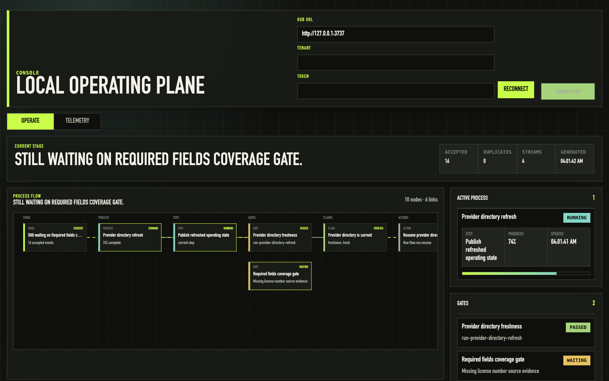

# Kontour Console

[](https://github.com/kontourai/console/actions/workflows/ci.yml)
[](LICENSE)

**One operating plane for the whole suite: claim status, process status, proof, queues, decisions, freshness, exceptions, and next actions.**

The primitives remain portable — Console never becomes the authority for any of them:

- [Surface](https://kontourai.io/surface) owns claim trust state.
- [Flow](https://kontourai.io/flow) owns process transparency and gate control.
- [Survey](https://kontourai.io/survey) owns fact-review records.
- [Veritas](https://kontourai.io/veritas) owns repo/change governance.
- [Flow Agents](https://kontourai.io/flow-agents) owns agent-facing runtime distribution.

This repo ships local-first Console foundation code alongside the product context and architecture decisions. It includes fixture inspection, local file sinks, deterministic replay, and a loopback-only development server; it is not a hosted production service.



## Published packages

- `@kontour/console-core` — shared record and process-flow shapes.
- `@kontour/console-server` — the local hub (event ingestion, projections, telemetry, SSE) plus the `kontour`, `console-inspect`, and `kontour-flow-bridge` bins.

The React UI (`console-ui`) remains an app in this repo rather than a package.

## Bridge a real Flow run

`kontour-flow-bridge` derives Console events from local [Flow](https://kontourai.io/flow) run files and delivers them to a hub — read-only over Flow's files, deterministic event ids, idempotent re-runs:

```sh
npx --package @kontour/console-server kontour serve          # hub on 127.0.0.1:3737
npx --package @kontour/console-server kontour-flow-bridge \
  --flow-root .flow --watch                                  # follow live runs
```

Point the Console UI at the hub and the operating plane follows your actual gated work — current step, advances, route-backs — with no demo scripting.

## See it locally

Start the hub and the UI, then replay the bundled cross-product example streams into it:

```sh
# terminal 1: loopback hub + UI together
npm run dev:local

# terminal 2: replay the example streams into the hub
for f in docs/examples/event-streams/*.jsonl; do
  while IFS= read -r line; do
    [ -n "$line" ] && curl -s -X POST -H "content-type: application/json" \
      --data "$line" http://127.0.0.1:3737/records >/dev/null
  done < "$f"
done
```

Open the UI, hit Reconnect, and the operating plane renders the replayed state: a Flow run waiting on a required-fields coverage gate, Surface claim freshness, and a Survey field review — the suite story in one screen.

## Package Layout

The Console prototype is split into TypeScript workspaces with clear ownership:

- `console-core` owns shared TypeScript record and process-flow shapes used across packages.
- `console-server` owns local file sinks, fixture/local inspection, current-state projection, and the loopback SSE hub.
- `console-ui` owns the React/Vite UI that renders hub state and live events.

Root commands delegate into those workspaces so a fresh checkout can still use `npm test`, `npm run typecheck`, `npm run inspect:fixtures`, and `npm run serve` from this directory.

## Contributor Hook Tooling

This repo includes optional local contributor tooling for Git hooks. To opt in, run:

```sh
npm run setup:repo-hooks
```

That command sets only this repository's local `core.hooksPath` to `.githooks`. It does not change global or system Git config. The tracked `.githooks/pre-push` hook runs the bounded existing Console lane:

```sh
npm test
```

Validate the hook wiring and drift checks with:

```sh
npm run validate:repo-hooks
```

For local/private boundary checks, set `CONSOLE_BOUNDARY_DENYLIST` to a comma- or newline-separated list before running validation.

Hook setup is not required for a fresh checkout to run package verification; `npm test` remains the direct verification command. These hooks are local contributor tooling, not Console event, projection, or control-plane semantics. The hook docs use generic suite products and producers language because product boundaries remain owned by suite primitives. When a push must intentionally skip local hooks, use Git's standard `--no-verify` mechanism.

## Local Fixture Inspection

Run the read-only fixture inspector from the repo root:

```sh
npm run inspect:fixtures
```

The command reads checked-in files under `docs/examples/event-streams/` and `docs/examples/projections/`, validates the local v0 envelopes, and prints event counts plus current claim, process, gate, review, action, and link summaries. Actions are shown as inert descriptors only; the inspector does not execute product commands, follow URLs, or mutate product-owned state.

## Local Console Producer Emission

A Console producer is the Kontour product or product runtime that emits control-plane records for Console. Surface, Flow, Survey, Veritas, and Flow Agents are the primary Console producers. Vertical products usually contribute through those primitives as extension metadata and refs, rather than depending on `.kontour` or Console directly. This is separate from any product-native "producer" concept inside those products, such as a crawler, verifier, importer, workflow runner, or agent.

Products can write local control-plane records without dependencies or hosted infrastructure. `LocalFileSink` writes under a configured `.kontour` root, appending events below `.kontour/events/` and writing current projection snapshots below `.kontour/projections/`.

Prototype package exports point at TypeScript source. Run programmatic examples in this repo with `node --import tsx` or another TypeScript loader until the packages gain a compiled publish target.

```ts
const {
  KontourEmitter,
  LocalFileSink,
  CompositeSink,
  InMemorySink
} = require("@kontour/console-server");

const memory = new InMemorySink();
const emitter = new KontourEmitter({
  sink: new CompositeSink([
    new LocalFileSink({ root: ".kontour" }),
    memory
  ])
});

const result = await emitter.emitEvent({
  schema: "kontour.console.event",
  version: "0.1",
  id: "event-provider-directory-updated",
  type: "claim.updated",
  occurredAt: "2026-06-01T16:00:00Z",
  producer: { product: "surface", id: "surface-console-producer" },
  scope: { product: "surface", kind: "tenant", id: "acme" },
  subject: { product: "surface", kind: "claim", id: "claim-provider-directory-current" },
  payload: {}
});

console.log(result.children.map((child) => ({
  sinkId: child.sinkId,
  outcome: child.outcome,
  recordId: child.recordId
})));
```

After a producer writes local records, inspect the generated `.kontour` tree without copying files into `docs/examples`:

```sh
node --import tsx console-server/bin/console-inspect.ts local
```

The same local read path is exported for programmatic consumers:

```ts
const { inspectLocalKontour } = require("@kontour/console-server");

const report = inspectLocalKontour({ rootDir: process.cwd() });
console.log(report.eventStreams.length, report.projections.length);
```

`inspectLocalKontour` recursively reads `.kontour/events/**/*.jsonl` and `.kontour/projections/**/*.json`, labels records as `local`, and treats action descriptors as read-only data. `npm run inspect:fixtures` remains fixture-only for checked-in examples under `docs/examples`.

`CompositeSink` returns one child result per sink, so a local `accepted` result can remain visible even when another sink fails. A future hosted API sink can be added as another child sink role in this fanout model, but this package does not implement an API, network transport, background retries, or remote ingestion.

## Local Hub Server

Run the local development hub from the repo root:

```sh
npm run serve
```

The `kontour serve` command binds to `127.0.0.1:3737` by default and exposes:

- `POST /records`
- `GET /state`
- `GET /inspect`
- `GET /stream`
- `GET /events`

`GET /stream` is the canonical server-sent event stream. It sends an initial `ready` event, an initial `state` event, and a `record.accepted` event after an accepted `POST /records`. `GET /events` returns local event stream JSON by default and remains an SSE compatibility path for `Accept: text/event-stream` clients. Browser-origin access is limited to loopback origins unless explicitly configured. Non-loopback local requests require the configured console token (`telemetryToken`, `CONSOLE_AUTH_TOKEN`, or `CONSOLE_TELEMETRY_TOKEN`) through `Authorization: Bearer ...` or `x-console-api-token`. The local hub persists through `.kontour` files and does not add a remote execution channel, product API fetcher, or action executor.

### Surface Claim Status/Freshness Producer Helper

`surfaceClaimStateToProjection()` and `surfaceFreshnessTransitionToEvent()` are the first Surface Console producer pattern in this package. They are dependency-free helper/example functions for mapping caller-owned Surface claim state into local Console records; they are not live Surface integration.

```ts
const {
  KontourEmitter,
  LocalFileSink,
  surfaceClaimStateToProjection,
  surfaceFreshnessTransitionToEvent
} = require("@kontour/console-server");

const emitter = new KontourEmitter({
  sink: new LocalFileSink({ root: ".kontour" })
});

await emitter.emitProjection(surfaceClaimStateToProjection({
  claimId: "claim-provider-directory-current",
  status: "verified",
  freshness: { status: "fresh", asOf: "2026-06-01T16:05:00Z" },
  validFrom: "2026-06-01T16:00:00Z",
  validUntil: "2026-06-30T16:00:00Z",
  lastUpdatedAt: "2026-06-01T16:05:00Z",
  generatedAt: "2026-06-01T16:06:00Z",
  evidenceRefs: [{ product: "surface", kind: "evidence", id: "evidence-directory-crawl" }],
  actionRefs: [{ product: "surface", kind: "action", id: "action-refresh-directory" }]
}));

await emitter.emitEvent(surfaceFreshnessTransitionToEvent({
  claimId: "claim-provider-directory-current",
  occurredAt: "2026-06-01T16:10:00Z",
  before: { status: "stale" },
  after: { status: "fresh" }
}));
```

Optional action descriptors supplied to the helper are persisted as inert projection data only. The helper does not fetch Surface data, start Flow, execute commands, dereference URLs, or mutate product state.

### Flow Process/Gate Status Producer Helper

`flowProcessStateToProjection()` and `flowGateTransitionToEvent()` are dependency-free Flow Console producer helper/example functions. They map caller-owned process and gate state into local Console records; they are not real Flow integration, do not run Flow control semantics, and do not perform action descriptors. Action descriptors are inert, read-only metadata for display and review.

```ts
const {
  KontourEmitter,
  LocalFileSink,
  inspectLocalKontour,
  getFlowProcessStatus,
  flowProcessStateToProjection,
  flowGateTransitionToEvent
} = require("@kontour/console-server");

const emitter = new KontourEmitter({
  sink: new LocalFileSink({ root: ".kontour" })
});

await emitter.emitProjection(flowProcessStateToProjection({
  processId: "run-provider-onboarding-42",
  status: "running",
  currentStep: { id: "review-provider-fields" },
  percentComplete: 62,
  generatedAt: "2026-06-01T18:12:30Z",
  openGateRefs: [{ product: "flow", kind: "gate", id: "gate-provider-review" }],
  gates: [{ id: "gate-provider-review", status: "open" }],
  actions: [{
    id: "action-resume-provider-onboarding",
    kind: "resume",
    authority: { product: "flow", command: "flow.run.resume" },
    subjectRefs: [{ product: "flow", kind: "run", id: "run-provider-onboarding-42" }]
  }]
}));

await emitter.emitEvent(flowGateTransitionToEvent({
  processId: "run-provider-onboarding-42",
  gateId: "gate-provider-review",
  occurredAt: "2026-06-01T18:15:00Z",
  before: { status: "waiting" },
  after: { status: "open" }
}));

const report = inspectLocalKontour({ rootDir: process.cwd() });
const statuses = getFlowProcessStatus(report.projections, {
  processId: "run-provider-onboarding-42"
});
console.log(statuses[0].status, statuses[0].actions[0].readOnly);
```

## Telemetry Storage

Console server telemetry uses a named storage adapter. The default is
`local-jsonl`, which preserves local behavior and writes accepted records to
`.kontour/telemetry/records.jsonl`.

Adapter selection can be configured through `ConsoleHubServerOptions`:

```ts
createConsoleHubServer({
  telemetryStorageAdapter: "sqlite",
  telemetryDatabaseUrl: ".kontour/telemetry/console.sqlite"
});
```

The same selection is available through explicit environment variables:

- `CONSOLE_TELEMETRY_STORAGE=local-jsonl|sqlite|postgres|sql`
- `CONSOLE_TELEMETRY_DATABASE_URL=...`
- `CONSOLE_DATABASE_URL=...`

Use `sqlite` for local SQL-backed testing without adding a package; it writes to
`CONSOLE_DATABASE_URL` / `CONSOLE_TELEMETRY_DATABASE_URL`, or defaults to
`.kontour/telemetry/console.sqlite`. Relative SQLite paths resolve under the
repo root; absolute paths and `file:` URLs are trusted local operator
configuration. Use `postgres` for hosted deployments such as Supabase. Console
does not fall back to local JSONL when a SQL adapter is selected; writes fail
safely if the selected adapter cannot be opened.

## Docs

- [Product Boundaries](docs/product-boundaries.md)
- [Event And Projection Schema](docs/specs/projection-schema.md)
- [Emitter, Sink, And Plane Contract](docs/specs/emitter-sink-plane-contract.md)
- [Telemetry Descriptor](docs/specs/telemetry-descriptor.md)
- [Example event streams](docs/examples/event-streams/)
- [ADR 0001: Console As Suite Management Plane](docs/adr/0001-console-as-suite-management-plane.md)

## License

[Apache-2.0](LICENSE) © Kontour AI
