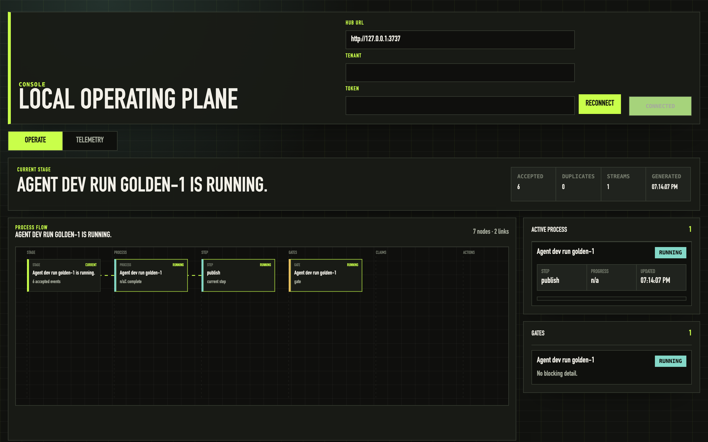

# Golden Demo: One Run Across The Suite

`scripts/golden-demo.ts` runs the whole Kontour story end to end on the **published packages** — nothing mocked, nothing replayed:

1. Installs `@kontourai/flow` and `@kontourai/survey` from npm into a temp workspace.
2. Starts a real Flow agent-dev run and passes the plan and implement gates with trust artifacts.
3. Fails verification — the gate routes the run back to implement with an attempt budget.
4. Projects a real Survey `ReviewOutcome` through `flowTrustArtifactFromReviewOutcome` and attaches it with `--supersede`, recovering the gate.
5. Prints the resume contract any future session would read.
6. Emits a `kontour.console.event` to the local hub at every transition, derived from the run's actual `state.json` — so the Console operating plane renders the run live as it happens.




## Run it

```sh
# terminal 1: hub + UI
npm run dev:local

# terminal 2
node --import tsx scripts/golden-demo.ts
```

Set `GOLDEN_DEMO_FAST=1` to skip the narrative pacing. Re-record the GIF with `vhs scripts/golden-demo.tape` after the script or CLI output changes.

## Boundaries

The demo is a consumer of public contracts only: the Flow CLI and run files, Survey's published adapter, and the hub's `/records` endpoint. Console renders what the products emitted; it does not decide gate outcomes, own review semantics, or invent state.
